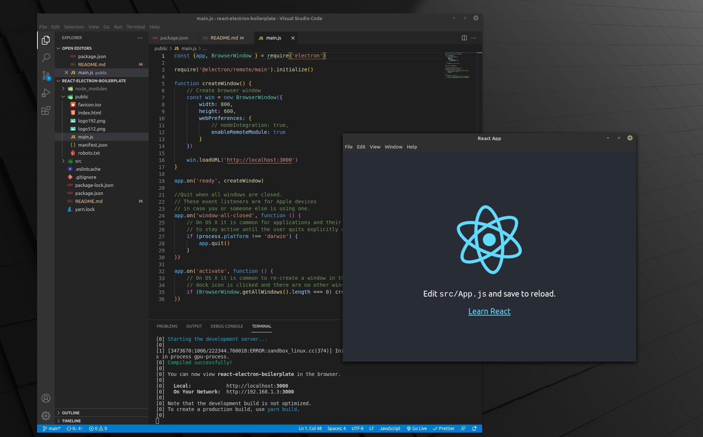

# react-electron-boilerplate

## Table of Contents

* [Description](#description)
* [Installation](#installation)
* [Usage](#usage)
* [License](#licenses)
* [Contributions](#contributions)
* [Tests](#tests)
* [Questions](#questions)
    
## Description

### Just as you run the npx for create-react-app, this boilerplate starts you at the "Happy Hacking!" beginning of React loaded on a desktop window, rather than a browser.
    
## Installation

### At this time you need to 'git clone' a copy, install dependencies, and run 'yarn electron:serve' to view the application for development.
    
## Usage

### This saves time in the setting up process of utilizing both React and Electron together.

## License

### ISC

## Contributions

### email me directly

## Tests

### yarn test

## Questions

### (https://github.com/letsgitthis)
### jbentley1011@gmail.com

## Demo

